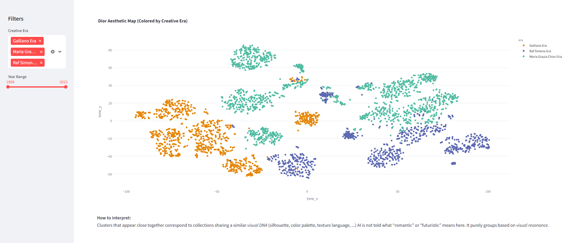
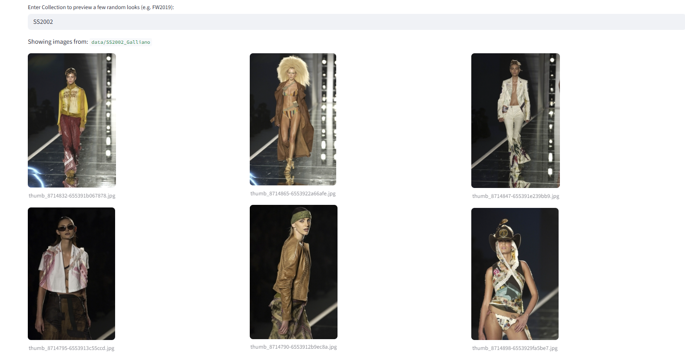
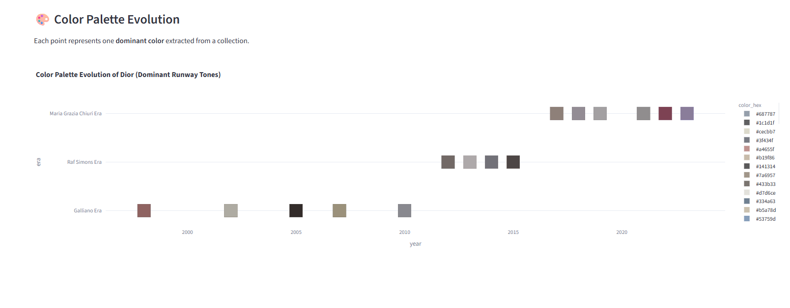
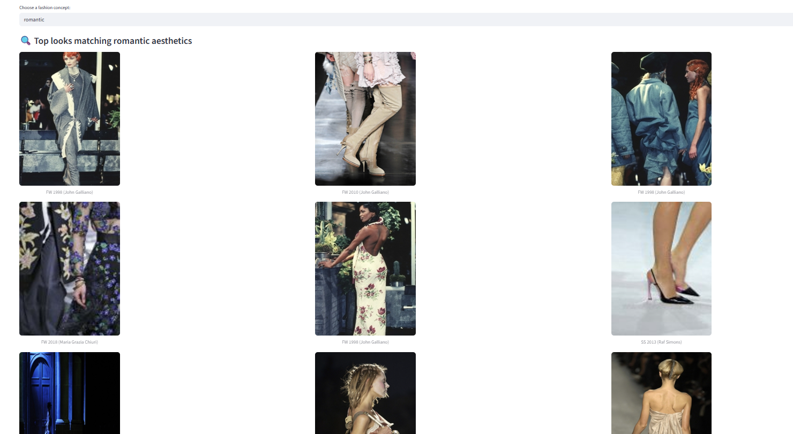
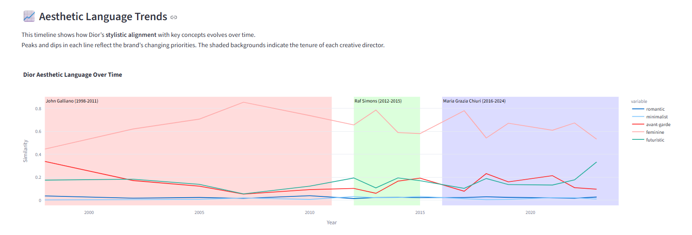

# Fashion Visual Intelligence: Dior's Aesthetic Evolution

This repository explores the **visual evolution of the luxury fashion house Dior** using computer vision and CLIP-based embeddings.
It demonstrates how to scrape, process, and analyse runway collections to reveal **brand-specific design languages**, **creative director eras**, and **aesthetic trends** over time.
Dior was chosen as the main example because it features distinct creative transitions from John Galliano’s theatrical maximalism to Raf Simons’ architectural minimalism and Maria Grazia Chiuri’s feminist romanticism, making it an ideal case to study how design identity evolves through leadership changes.
The framework can easily be adapted to analyse other fashion houses.

---

## 🌍 Project Overview

This end-to-end pipeline combines **AI, fashion history, and data visualisation** to map how visual styles evolve across decades and creative eras.

### Key Features

- **Automated Runway Scraping** (via Selenium + BeautifulSoup) (Source: https://www.firstview.com/)
- **Structured Metadata Generation** for Dior collections  
- **Visual Embedding Extraction** using OpenAI’s CLIP  
- **t-SNE & PCA Style Maps** to visualise aesthetic evolution  
- **Semantic Concept Scoring** (“romantic”, “minimalist”, “avant-garde”…)  
- **Interactive Streamlit Dashboards** for visual exploration

---

## Quickstart

### Clone the repository
git clone https://github.com/axelsgit/fashion-visual-intelligence.git
cd fashion-visual-intelligence
2. Install dependencies
pip install -r requirements.txt
3. Run the end-to-end pipeline
Pay attention to order of scripts.

## Example full run:

### 1 Scrape runway collections
image_scraper.py

### 2 Create structured metadata
create_metadata_csv.py

### 3 Expand metadata with all images
create_full_metadata_csv.py

### 4 Generate CLIP embeddings
extract_embeddings.py

### 5 Visualise aesthetic evolution
visualise_evolution.py

### 6 Compute concept similarity scores
compute_concept_similarity.py

### 7 Launch interactive dashboard
streamlit run app_dashboard_dior.py

---

## 📂 Project Structure

fashion-visual-intelligence/ 
│ 
├── image_scraper.py # Scrapes runway photos from FirstView 
├── create_metadata_csv.py # Creates Dior base metadata CSVs 
├── create_full_metadata_csv.py # Expands metadata with all image file paths 
├── extract_embeddings.py # Extracts CLIP embeddings for all images 
├── visualise_evolution.py # Performs PCA + t-SNE visual analysis 
├── compute_concept_similarity.py # Computes similarity to style concepts 
├── app_dashboard_dior.py # Streamlit dashboard for Dior 
│ 
├── data/ # data created within scripts 
│ ├── metadata_dior_womenswear.csv 
│ ├── metadata_dior_womenswear_full.csv 
│ ├── dior_concept_scores.csv 
│ ├── dior_tsne_results.csv 
│ ├── embeddings_metadata_dior.csv 
│ ├── embeddings_clip_dior.npy 
│ └── *collection image folders* 
│ 
├── assets/ # screenshots 
├── requirements.txt 
└── README.md 

---

## Example Output

### t-SNE Style Evolution Maps  
Visual clusters showing shifts between **creative eras** and **seasonal directions**.

 

### Look Preview 
Preview of a few random looks from a chosen collection.

 

### Colour palette evolution  
Dominant colour for each analysed collection over the decades.

 

### Concept similarity explorer  
Explore how AI understands **aesthetic concepts** like “romantic”, “minimalist”, or “avant-garde” in Dior’s collections. The model compares the runway image with the text description of that concept, highlighting which collections most embody each aesthetic.

 

### Aesthetic language trends  
This timeline shows how stylistic alignment with key concepts evolves over time. Peaks and dips in each line reflect the brand’s changing priorities. The shaded backgrounds indicate the tenure of each creative director.

 

---

## How It Works

**1 Scraping:**  
Uses Selenium to load dynamic image galleries from *FirstView* runway archives.

**2 Metadata Structuring:**  
Each collection is tagged with year, season, director, and creative era.

**3 Feature Embedding:**  
CLIP (ViT-B/32) converts each image into a high-dimensional aesthetic vector.

**4 Dimensionality Reduction:**  
PCA → t-SNE or PCA 3D visualises stylistic similarity and drift.

**5 Concept Scoring:**  
CLIP measures how each look aligns with style descriptors like “romantic”, “futuristic”, or “minimalist”.

**6 Dashboard Visualisation:**  
Streamlit dashboards let you explore evolution interactively by **era**, **year**, or **concept**, enables preview of looks by collection and aesthetic concept, and shows development of dominant colours and aesthetic language.

---

## Creative Director Eras

### **Dior**
- *John Galliano (1998–2011)* - maximalist theatrical couture  
- *Raf Simons (2012–2015)* - minimal architectural silhouettes  
- *Maria Grazia Chiuri (2016–2024)* - feminist romantic modernism   

---

## Analytical Insights  

The analysis revealed patterns that align with Dior’s well-known aesthetic DNA, a blend of romanticism, avant-garde experimentation, and timeless femininity.  
Across decades, AI-based visual analysis captured the transition from John Galliano’s theatrical maximalism, through Raf Simons’ architectural minimalism, to Maria Grazia Chiuri’s poetic and feminist romanticism.  

However, the CLIP-based trend chart shows that these shifts are not always reflected in the model’s outputs. While Raf Simons’ era is widely known for its minimalist approach, the AI detected only a weak similarity to the concept *“minimalist.”* This suggests that CLIP’s interpretation is based primarily on surface-level visual cues rather than the underlying conceptual or structural principles of minimalism.  

These results highlight both the potential and the limitations of AI in fashion interpretation. Dior’s enduring appeal lies in how its creative directors continue to evolve the brand’s narrative language while maintaining a coherent emotional and stylistic core.  

| Creative Director | Era | Aesthetic Core | Visual Traits | AI Concept Alignment (CLIP Similarity) |
|--------------------|------|----------------|----------------|--------------------------------------|
| John Galliano | 1998–2011 | Theatrical Romanticism | Dramatic silhouettes, bold color, fantasy couture | Romantic ↑  Avant-garde ↑ |
| Raf Simons | 2012–2015 | Modern Minimalism | Architectural lines, purity of form | Minimalist (weak correlation) |
| Maria Grazia Chiuri | 2016–2024 | Feminist Romanticism | Soft draping, symbolism, wearable narrative | Romantic ↑  Futuristic ↑ |

## ⚠️ Disclaimers

### Disclaimer

- This project uses publicly accessible runway imagery from FirstView and similar fashion archives for **non-commercial, educational, and research purposes only**.  
All images remain the property of their respective copyright holders.  
Visual samples shown in this dashboard are **low-resolution thumbnails** used solely for academic illustration and AI-based visual analysis.  
- The project **does not redistribute or claim ownership** of any images and is **not affiliated with or endorsed by Dior, FirstView, or any associated entities**.  
- All data and results are provided for **academic visualisation and fashion analysis**.  
- If you are a rights holder and wish for specific content to be removed, please contact the repository maintainer for prompt removal.

---

👩‍💻 **Author:** Axel Heussner  

📧 [linkedin.com/in/axel-heussner](https://www.linkedin.com/in/axel-heussner)
